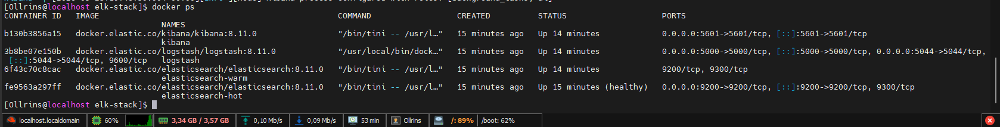
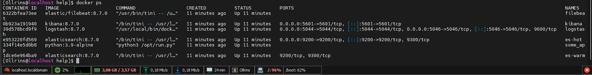
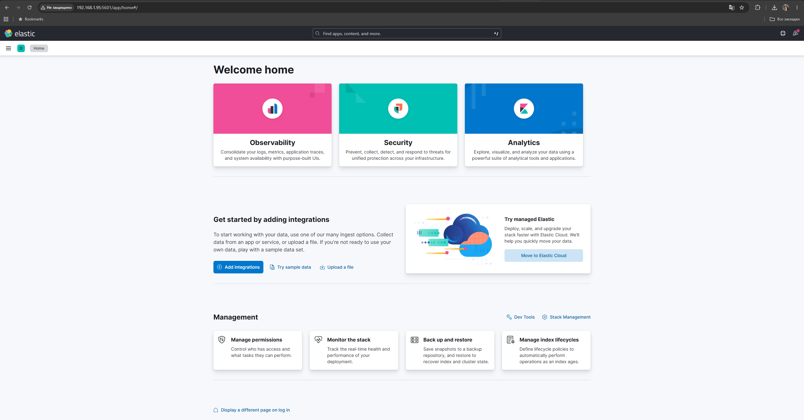
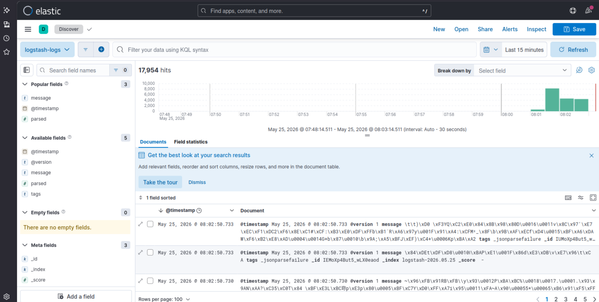

## Задание 1

Cкриншот docker ps через 5 минут после старта всех контейнеров без help 

  
   

Cкриншот docker ps через 5 минут после старта всех контейнеров с help 
   

  
   

Cкриншот интерфейса kibana
   

  
   

## Задание 2

  
   

